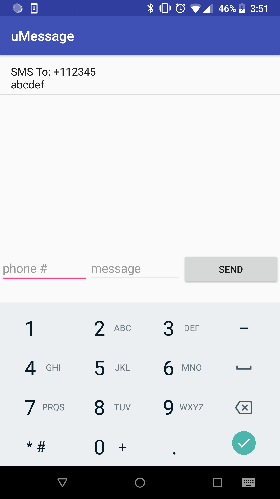

# uMessage
Universal text messaging application.

A text messaging app for Android that facilitates the uMessage online text messaging web app. Running the app connects the user's phone to the uMessage server, which enables them to utilize the [uMessage website](https://simple-umessage-server.herokuapp.com/) to send text messages through their phone from their computer or any internet-connected device. The app also serves as a text messaging client for the user as well.

[uMessage Server repo](https://github.com/mrdanshih/uMessage-Server)

The uMessage client mobile app
 

The uMessage website for sending text messages remotely
 